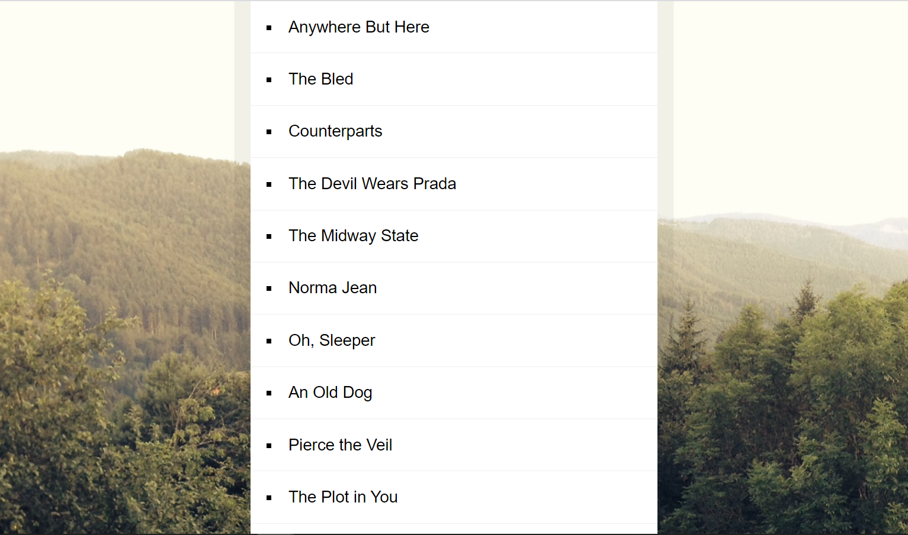

# Sort Without Articles
## Demo:

## Live:
https://sebastianjuszczynski.github.io/Sort-Without-Articles/
## Technologies:
-  HTML

-  CSS

- &nbsp;&nbsp;JS

### Description:
Small aplication just to train Javascript methods:
> replace()
> 
> sort()

Items in list are sorted alphabetically exluding:
> a
> 
> an
> 
> the

Next project from 30 days challenge by **Wes Bos**